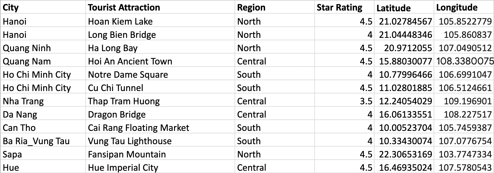

# Panoramic_Vietnam_tour (updating..)

## 1. Introduction: 

Tourism in Vietnam has proved itself to be one of the potential fields of national economic devel-
opment. In this project, we simulate the decision-making process of a student coming to Vietnam for a
1-month summer break vacation. The student’s goal is to visit as many tourist attractions across the
country as possible, within their limited time and budget constraints. The student is allowed to choose
one means of transportation (walking, bus, taxi, train, airplane, etc.) for each pair of departure and
arrival to optimize their traveling plan.
The model is built on the foundation of the “Traveling Salesman” problem, with new aspects of
geographical distances, the means of transportation, and how the variables interact with one another
using the Google Maps API package. The goal of the model is to suggest a list of tourist attractions and
the best transportation. Throughout this project, our hope is also to popularize Vietnamese tourism to
Denison students while making optimal travel plan for foreigners coming to Vietnam for the first time
who don’t know where to start.

## 2. Description:

Our preliminary modeling is similar to the Van Gogh lab to some extent. The result is to find a
path of maximum tourist attractions for students within their time and budget constraints. The student
may spend at least 5 days in locations in the same city.
Furthermore, our model is used to find the optimal transportation selections to which the student
can choose among the 5 possible means of transportation. Each means of transportation has trade-offs
between time and cost, thus this model will help discover the optimal solution that optimizes the student
experience with a minimal budget.

### 2.1 Decision variables:

• aij , bij , cij , dij , eij (binary variables): which means of transportation to go from i-j (walking,
bus, taxi, train, or airplane)  
• timeij : time to take from i-j using that transportation.  
• costij : cost from i-j using that transportation.  

### 2.2 Constraint:

• Location constraints: aij + bij + . . . + eij ≤ 1 
Their sum has to be 1 as we use 1 transportation for i-j 

• Time constraints: ∑ timeij <= 600 (hours) 
The total hours spent on traveling is 30 days (20 hours a day for total 30 days) 

• Budget constraints: ∑ costij <= 1000 ($) 
Total money spent on traveling is $1000 

• Traveling constraints: timeij have delays of at least 8 hours 
Spend at least 8 hours each time the student arrives to new location 

### 2.3 Objective function:

• stari: the rating of the tourist attraction  
Maximum ∑ stari  
Where f (cost) is a function used to normalize variable cost so that we can maximize the number of
locations and minimize cost simultaneously  

## 3. Data:

We started the project by pulling the data from three different sources: **Google Maps** (for the
locations’ co-ordinations), **Tripadvisor** (for ”Stars” ratings of the tourist spots), and **Rome2Rio** (for the
transportation time and cost among the locations). We made some transformations to the data and
create a second data set to have information on transportation options and the amount cost for each
type of transportation traveling from 1 place to the other. The translated data has the permutation of
location pairs with traveling expenses corresponding with the means of transportation the model will
select.

Figure 1: Location Data

*Data Preparation* : In our dataset, we can see that not all 5 options are always available when
we travel from one place to another. Therefore, one of the significant changes that we did (within the
process of Data Cleaning with Python) was converting the NULL values in the cost of transportation
into 999 (data type: integer). The main reason why we made this change is that our Gurobi model
will not select this option when the Gurobi model is executed due to the force of cost constraints. This
will mimic the behavior of NULL data while also helping the code work smoothly without running into
syntax errors.

With the process of building up the mathematical backbone for the optimization model, we begin
by setting with the time, budget, and transportation data by this following mathematical representation:
Let i be the departing location and j be the arrival destination, such that:

• timeij : time to take from i-j using that transportation. 
• costij : cost from i-j using that transportation. 
• stari: The rating for each location. 

## 4. Result:

See the [final report](https://github.com/Ph1n-Pham/Panoramic_Vietnam_tour/blob/main/Report.pdf) for detailed result analysis!

## 5. Reference:

1. Fuentes, G. E. A., Gress, E. S. H., Mora, J. C. S. T., amp; Mar ́ın, J. M. (2018, August 22).
Solution to travelling salesman problem by clusters and a modified multi-restart iterated local
search metaheuristic. PLOS ONE. Retrieved April 7, 2023, from
https://journals.plos.org/plosone/article?id=10.1371%2Fjournal.pone.0201868sec008 
2. GeeksforGeeks. (2023, February 6). Traveling salesman problem using Dynamic Programming.
GeeksforGeeks. Retrieved April 7, 2023, from https://www.geeksforgeeks.org/travelling-salesman-problem-using-dynamic-programming/ 
3. Google. (2023, April 4). Distance Matrix API request and response. Google. Retrieved April 7,
2023, from https://developers.google.com/maps/documentation/distance-matrix/distance-matrix 
4. Ltd, R. P. (2010). Rome2rio. Retrieved April 7, 2023, from
https://www.rome2rio.com/map/
